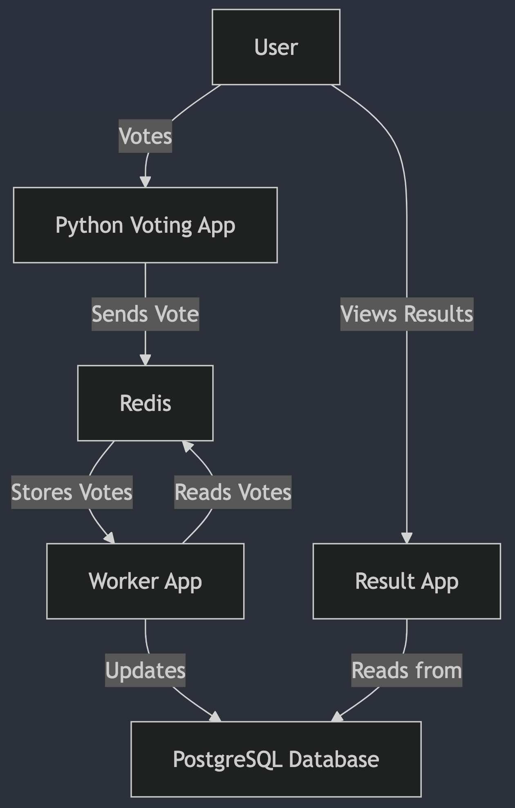

# Voting App on Kubernetes

This repository contains a Kubernetes-based microservices deployment of a simple Voting App, originally from the KodeKloud Kubernetes Crash Course.

## About the App

This is a simple web-based voting application where users can vote for their favorite animal: Cats 🐱 or Dogs 🐶.

### How It Works



- Voting App - Users vote between Cats or Dogs. The application is written in Python.

- Redis (Cache) - Votes are temporarily stored in Redis.

- Worker - A background worker reads votes from Redis and updates the PostgreSQL database.

- PostgreSQL (Database) - Stores the final vote count.

- Result App - Users can see live vote results. This application is written in Node.js.

## Tech Stack

- **Kubernetes** for container orchestration
- **Minikube** to run Kubernetes locally
- **Docker** for the containerized microservices

## Kubernetes Networking Setup

- **Redis Service**: A **ClusterIP** Service (`redis-service.yaml`) so that the `Voting App` & `Worker` can access it internally.

- **PostgreSQL Service**: Another **ClusterIP** Service (`postgres-service.yaml`) to allow `Worker` & `Result App` to connect to the database.

- **NodePort Services**: Required for `Voting App` & `Result App` to be accessible externally (`voting-app-service.yml`, `result-app-service.yml`).

## How to Run

1️. Start Minikube:

```bash
minikube start
```

1. Apply all Kubernetes manifests:

```bash
kubectl apply -f manifests/
```

1. Get the Minikube service URLs

voting app:

```bash
minikube service voting-service --url
```

result app:

```bash
minikube service voting-service --url
```

Now, open the URLs in your browser and test the Voting App!

## License & Credits

This project is based on the **KodeKloud Kubernetes Crash Course (YouTube)** and uses Docker images provided by **KodeKloud**.

#### Docker Images Used:

1. kodekloud/examplevotingapp_vote:v1

1. kodekloud/examplevotingapp_result:v1

1. kodekloud/examplevotingapp_worker:v1
